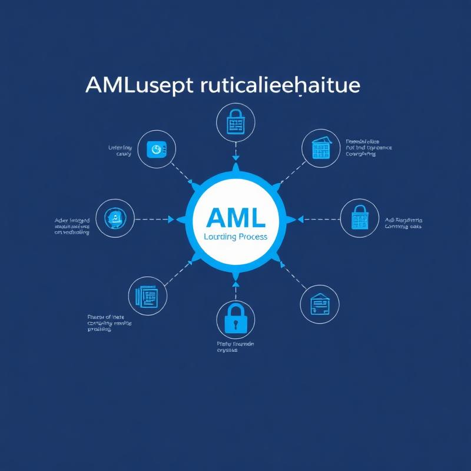

> Imagine despertar un día y descubrir que sus cuentas, tanto las tradicionales como las de criptomonedas, han sido congeladas.

Esta no es una pesadilla lejana, sino una posibilidad cada vez más real para empresas y particulares que operan en mercados volátiles. **Turquía se prepara para implementar una nueva y estricta legislación que otorgará a *MASAK*, la unidad de inteligencia financiera del país, el poder sin precedentes de congelar activos para combatir el lavado de dinero** (*AML*). En un entorno económico donde la *lira turca* ha visto una depreciación constante desde 2018, impulsando a muchos hacia las *criptomonedas* como refugio, **la pregunta no es si sus operaciones están bajo escrutinio, sino cuándo.** ¿Está su negocio preparado para enfrentar esta nueva era de vigilancia financiera, o se arriesga a la parálisis total de sus operaciones?

## MASAK al Acecho: La Expansión de un Poder sin Precedentes

La *Financial Crimes Investigation Board* (*MASAK*), el organismo turco de inteligencia financiera adscrito al Ministerio de Finanzas y Tesoro, **está a punto de recibir una ampliación significativa de su mandato.** La propuesta de nueva legislación, diseñada para alinear a Turquía con los rigurosos estándares del *FATF* (Grupo de Acción Financiera Internacional), **permitirá a *MASAK* no solo congelar cuentas bancarias tradicionales, sino también las de *criptomonedas*.** Este cambio radical representa un salto cualitativo en la capacidad de las autoridades para intervenir en el flujo de capital, tanto *fiduciario* como *digital*. Aunque aún no se ha proporcionado un cronograma exacto para su presentación en la Gran Asamblea Nacional, la inminencia de este proyecto de ley debería encender todas las alarmas.

> La capacidad de un organismo regulador para inmovilizar activos con tal facilidad introduce un nivel de riesgo operativo y financiero que ninguna entidad puede permitirse ignorar.

La pregunta clave es: ¿cómo garantizará su organización que no será la próxima en la mira de esta poderosa entidad?

## El Contexto Económico: Un Caldo de Cultivo para la Vigilancia Extrema

Para comprender la urgencia de esta nueva legislación, es crucial analizar el contexto económico turco. Desde 2018, la **lira turca ha experimentado una fuerte depreciación**, inmersa en una prolongada crisis financiera y económica caracterizada por alta inflación, aumento de los costos de endeudamiento e impagos de préstamos. Esta inestabilidad **ha llevado a muchos ciudadanos y empresas a buscar refugio en activos alternativos, siendo las *criptomonedas* uno de los mayores impulsores de adopción en el país.** En 2020, por ejemplo, *Bitcoin* valía aproximadamente 100.000 *liras turcas*, una cifra que ilustra el valor significativo que se maneja en este espacio. Sin embargo, **lo que para algunos es una salvaguarda contra la depreciación monetaria, para las autoridades es un potencial vector para el lavado de dinero.** Esta dualidad es precisamente lo que impulsa la necesidad de una legislación *AML* más estricta. Las transacciones criptográficas, a menudo percibidas como anónimas, se convierten en un objetivo principal para la vigilancia de *MASAK*, y cualquier entidad que opere con ellas, o incluso que tenga vínculos tangenciales, se expone a un riesgo elevado de ser investigada y, potencialmente, sancionada.

> La complacencia en este entorno no es una opción; es una invitación al desastre.

## Riesgos Inminentes: Más Allá de la Congelación de Cuentas

La amenaza de que *MASAK* congele cuentas no es solo un inconveniente operativo; es una **catástrofe potencial con ramificaciones de gran alcance.** Una cuenta congelada significa la **interrupción inmediata de sus operaciones**, la incapacidad de pagar a proveedores, empleados o acceder a fondos esenciales. Esto puede llevar a la paralización total de un negocio, independientemente de su tamaño o sector. Pero los riesgos no terminan ahí.

> La simple sospecha de incumplimiento de las normativas *AML* puede acarrear daños reputacionales irreparables, erosionando la confianza de clientes e inversores y afectando su posición en el mercado.

Además, las **investigaciones *AML* suelen ser prolongadas y costosas**, implicando honorarios legales significativos, multas exorbitantes y la posibilidad de sanciones penales para los responsables. En un entorno donde las regulaciones se endurecen y la vigilancia se intensifica, la falta de sistemas robustos para detectar y prevenir el lavado de dinero no solo es una deficiencia, sino una **vulnerabilidad crítica que su empresa no puede permitirse.** La pregunta crucial es: ¿Está usted dispuesto a arriesgar la continuidad de su negocio y su reputación, o actuará proactivamente para blindarse contra estos peligros crecientes?

### Llamada a la Acción

La nueva realidad regulatoria en Turquía **exige una respuesta inmediata y contundente.** La amenaza de *MASAK* no es un rumor, es una inminente ampliación de poderes que puede impactar directamente en la estabilidad de sus operaciones y la seguridad de sus activos.

> No espere a que sus cuentas sean congeladas para darse cuenta de la urgencia de una estrategia de cumplimiento robusta.

**Nuestra Plataforma *AML*, con sus alertas avanzadas en transacciones y automatización inteligente de procesos, es la solución definitiva que su negocio necesita.** Le permite anticipar riesgos, monitorear cada movimiento y asegurar la conformidad total con los estándares globales del *FATF*, **protegiéndolo de las sanciones y el escrutinio de *MASAK*.** Blindese contra la incertidumbre económica y regulatoria. Contáctenos hoy mismo y descubra cómo nuestra tecnología puede ser su escudo impenetrable en esta nueva era de vigilancia financiera. No deje su futuro al azar; tome el control con la solución más avanzada del mercado.

### Fuentes

*   [turke-watchdog-power-freeze-crypto-accounts-crackdown](https://es.cointelegraph.com/news/turke-watchdog-power-freeze-crypto-accounts-crackdown) 
